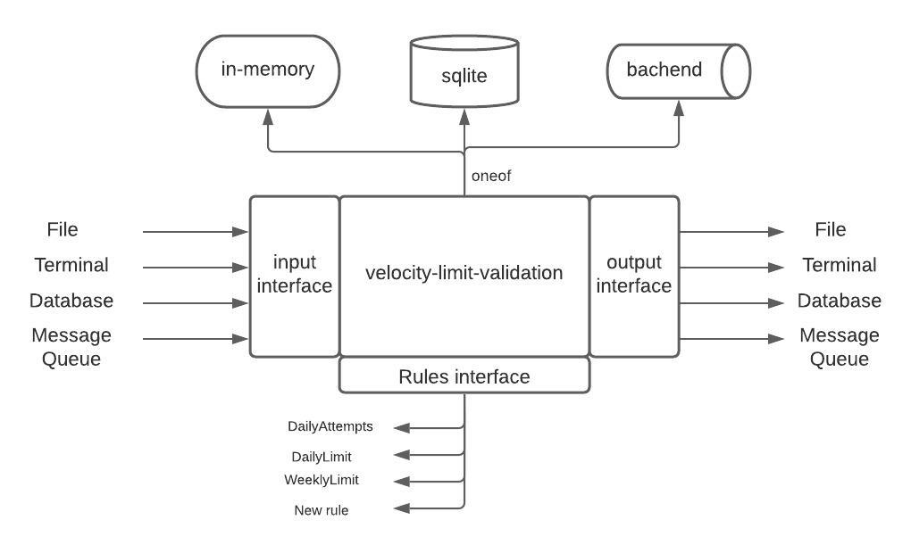

# Design

velocity-limit-app is designed to be a flexible and pluggable application. It is designed with an assumption that even though the immediate requirement is to read and write to file, it will eventually be a part of a larger data pipeline and would need to support different sources and sinks like message broker, DB etc.
Ideally, we'd check the assumption with the product team and if it is ascertained that the application will ever only be used with files then some of the complexity of the program can be done away with, thereby reducing development time.

Following is a block diagram depicting design of the application



# Code-structure
* validation package contains business logic to carry-out velocity limit chekcs on incoming funds. During application init, it builds a chain of rules that will be run against each incoming fund. 
Any new rule must implement "Rule" interface which only has one function Do() that accepts incoming deposit and returns it passes validation.

```python
//Rules ...
type Rule interface {
	Do(context.Context, *Deposit) (bool, error)
	String() string
}
```


The order of rules can be specified in validate.BuildRulesChain()

* io package defines input/output interfaces that every new source or sink will have to implement. Currently it supports file and terminal source/sink.

```python
//Ingester Every source will have implement this interface
type Ingester interface {
	Read(context.Context, chan<- string, *sync.WaitGroup)
}

//Sink Every sink will have implement this interface
type Sink interface {
	Write(context.Context, <-chan string, *sync.WaitGroup)
}
```
# Building project

Run "make" from the root directory. 
makefile installs dependencies, builds the project for multiple platforms(Linux and Windows), runs unit tests, test coverage, and static code analysis.
golangci-lint is used for static code analysis.


## Assumptions:-
* CustomerId/loadID is a positive integer